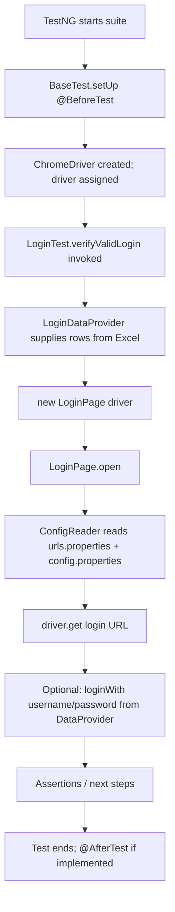

# Automation (Selenium + TestNG)

UI test automation for RestoreSkill using **Selenium WebDriver**, **TestNG**, **PageFactory**, **DataProvider**, and **Excel**-driven test data.

---

## Prerequisites

- **Java 17** (matches `maven.compiler.release` in `pom.xml`)
- **Maven 3.x**
- **Google Chrome** installed (tests use `ChromeDriver`; Selenium Manager resolves the driver in supported setups)

---

## Repository layout (what lives where)

| Path | Role |
|------|------|
| `pom.xml` | Maven project definition: dependencies (Selenium, TestNG, Apache POI, logging, etc.) and build settings. |
| `src/main/java/com/restoreSkill/Automation/base/BaseTest.java` | Test base class: creates `WebDriver` in `@BeforeTest`, exposes `driver` to subclasses. |
| `src/main/java/com/restoreSkill/Automation/locators/LoginPageLocators.java` | **Locators only** for the login module: XPath strings as constants (no WebDriver logic). |
| `src/main/java/com/restoreSkill/Automation/pages/login/LoginPage.java` | **Page object** for login: `PageFactory` + `@FindBy` using locators from `LoginPageLocators`; methods like `open()`, `loginWith()`, `isDashboardVisible()`. |
| `src/main/java/com/restoreSkill/Automation/pages/login/ProviderLoginPageObject.java` | Stub/example page object for a provider flow; placeholders only (empty XPath). Extend when automating that module. |
| `src/main/java/com/restoreSkill/Automation/utils/ConfigReader.java` | Loads `urls.properties` + `config.properties` from the classpath and exposes getters (`getUiLoginUrl()`, `getUiUsername()`, etc.). |
| `src/main/java/com/restoreSkill/Automation/utils/ExcelUtils.java` | Reads rows from an `.xlsx` sheet into `Object[][]` for TestNG `DataProvider`. Can create a default Excel file if missing. |
| `src/main/resources/config/urls.properties` | **UI URLs** (login, base, optional dashboard/provider, legacy `login.url`). |
| `src/main/resources/config/config.properties` | **UI credentials** (`ui.username`, `ui.password`); optional override via env vars documented in the file. |
| `src/test/java/com/restoreSkill/Automation/dataproviders/LoginDataProvider.java` | TestNG `@DataProvider(name = "loginData")` that delegates to `ExcelUtils` for the login sheet. |
| `src/test/java/com/restoreSkill/Automation/tests/LoginTest.java` | Sample TestNG test class: extends `BaseTest`, uses `loginData` provider, drives `LoginPage`. |
| `src/test/java/com/restoreSkill/Automation/tests/LoginAdmin.java` | Empty placeholder test class (skeleton for future cases). |
| `src/test/resources/testdata/LoginData.xlsx` | *(Created at runtime if absent)* Excel used by `LoginDataProvider` — sheet name `LoginData`, header row + data rows. |
| `src/test/resources/testng.xml` | TestNG suite: which classes run and which **listeners** are registered (logging + retry). Referenced by **Maven Surefire** in `pom.xml`. |
| `src/main/java/.../listeners/TestNgLoggingListener.java` | TestNG `ITestListener`: logs test **start**, **pass**, **fail**, **skip**. |
| `src/main/java/.../listeners/RetryListener.java` | TestNG `IAnnotationTransformer`: attaches `RetryAnalyzer` to every `@Test`. |
| `src/main/java/.../listeners/RetryAnalyzer.java` | TestNG `IRetryAnalyzer`: decides whether to **re-run** a failed test (up to **3** retries). |
| `src/main/resources/log4j2.xml` | **Log4j2** configuration (console pattern, log level for `com.restoreSkill.Automation`). |

Generated output (do not commit as source):

- `target/` — Maven build output  
- `test-output/` — TestNG HTML reports  

---

## Code flow (end-to-end)

The following describes how a typical login test run is orchestrated.



**Step-by-step (plain language):**

1. **Maven / TestNG** discovers test classes under `src/test/java` (for example `LoginTest`).
2. **`BaseTest`** runs **`@BeforeTest`**: builds a **`ChromeDriver`**, maximizes the window, sets implicit wait, and stores the instance in **`driver`**.
3. **`LoginTest`** is annotated with **`@Test(dataProvider = "loginData", dataProviderClass = LoginDataProvider.class)`**.
4. **`LoginDataProvider.getLoginData()`** calls **`ExcelUtils.readSheetData(...)`**, which reads **`src/test/resources/testdata/LoginData.xlsx`** (sheet **`LoginData`**) and returns a **2D array** of cell values (one row per test iteration).
5. The test method receives parameters (for example **`username`**, **`password`**) from that row. Your current `LoginTest` opens the app via **`LoginPage`**; you can wire **`loginPage.loginWith(username, password)`** when ready.
6. **`LoginPage`** uses **PageFactory** (`PageFactory.initElements`) and **`@FindBy(xpath = LoginPageLocators.…)`** so element location strings stay in **`LoginPageLocators`**, not scattered in test code.
7. **`LoginPage.open()`** calls **`ConfigReader.getLoginUrl()`** (or **`getUiLoginUrl()`**), which merges **`urls.properties`** then **`config.properties`** and normalizes the URL (adds `https://` if the protocol is omitted).
8. After the test, lifecycle teardown would run in **`@AfterTest`** in `BaseTest` when uncommented (currently commented in code — re-enable to **`quit()`** the browser).

---

## Configuration flow

```text
urls.properties  ──┐
                   ├──► ConfigReader (merged Properties) ──► getters used by page objects / tests
config.properties ─┘
```

- Change **environment or host** by editing **`src/main/resources/config/urls.properties`**.
- Change **default UI credentials** in **`src/main/resources/config/config.properties`**, or set **`AUTOMATION_UI_USERNAME`** / **`AUTOMATION_UI_PASSWORD`** for CI or local secrets.

---

## Excel data format

- **File:** `src/test/resources/testdata/LoginData.xlsx`  
- **Sheet name:** `LoginData` (see `LoginDataProvider`)  
- **Row 1:** column headers (for example `username`, `password`)  
- **Row 2+:** data rows; each row becomes one invocation of the test method with parameters in column order  

If the file is missing, **`ExcelUtils.ensureExcelExists`** can create a minimal workbook with sample data (see implementation).

---

## How to run

From the project root:

```bash
mvn clean test
```

In **Eclipse / IntelliJ**, run the TestNG suite or right-click `LoginTest` → Run as TestNG Test.

---

## Design patterns used

| Pattern | Where |
|---------|--------|
| **Page Object** | `LoginPage`, `ProviderLoginPageObject` |
| **PageFactory** | `@FindBy` + `PageFactory.initElements` in page classes |
| **Separation of locators** | `LoginPageLocators` (XPath constants per feature/module) |
| **Data-driven testing** | `@DataProvider` + Excel via `ExcelUtils` |
| **Centralized config** | `ConfigReader` + `urls.properties` / `config.properties` |

---

## Logger (SLF4J + Log4j2)

### Where the code lives

| What | File |
|------|------|
| Log configuration (appenders, pattern, levels) | `src/main/resources/log4j2.xml` |
| Example usage in base test | `src/main/java/com/restoreSkill/Automation/base/BaseTest.java` |
| Retry attempt messages | `src/main/java/com/restoreSkill/Automation/listeners/RetryAnalyzer.java` |
| Per-test lifecycle logs (START / PASS / FAIL / SKIP) | `src/main/java/com/restoreSkill/Automation/listeners/TestNgLoggingListener.java` |

Logging uses **SLF4J** (`org.slf4j.Logger`) with **Log4j2** as the implementation (`log4j-slf4j2-impl` in `pom.xml`). Do not add `slf4j-simple` alongside Log4j2 or you may get conflicting bindings.

### How to use the logger in your own classes

In any class (page object, test, utility), declare a static logger and log at the level you need:

```java
import org.slf4j.Logger;
import org.slf4j.LoggerFactory;

public class MyPage {
    private static final Logger log = LoggerFactory.getLogger(MyPage.class);

    public void doSomething() {
        log.info("Opening section X");
        log.debug("Detail only when debug enabled");
        log.warn("Unexpected but handled: {}", someValue);
    }
}
```

- **Package level:** `log4j2.xml` sets logger `com.restoreSkill.Automation` to **INFO** (and sends it to the console). Adjust `<Logger name="com.restoreSkill.Automation" level="...">` to `debug` for more detail.
- **Root** logger is **WARN** so third-party libraries stay quiet unless you widen it.

---

## Retry listener and `RetryAnalyzer`

### Where the code lives

| What | File |
|------|------|
| Applies retry to **all** `@Test` methods | `src/main/java/com/restoreSkill/Automation/listeners/RetryListener.java` |
| Retry policy (max attempts) | `src/main/java/com/restoreSkill/Automation/listeners/RetryAnalyzer.java` |
| Registers listeners with TestNG | `src/test/resources/testng.xml` (`<listeners>`) |

### How it works

1. **`RetryListener`** implements TestNG’s **`IAnnotationTransformer`**. When TestNG loads your tests, it calls `transform(...)` for each `@Test`. The listener sets **`retryAnalyzer = RetryAnalyzer.class`** on that annotation, so you do not need to repeat `@Test(retryAnalyzer = ...)` on every method.

2. When a test method **fails**, TestNG asks **`RetryAnalyzer`** (which implements **`IRetryAnalyzer`**) whether to run the method again via **`retry(ITestResult result)`**.

3. **`RetryAnalyzer`** keeps a **per-instance** counter (TestNG creates a new analyzer instance per test method configuration). While the failure count is within the limit, it returns **`true`** so TestNG **re-executes** the same test. The constant **`MAX_RETRY = 3`** means up to **three extra runs after the first failure** (four executions total if the test keeps failing). Change `MAX_RETRY` in `RetryAnalyzer.java` if you need a different cap.

4. Retry decisions apply only when the result status is **failure**; successes do not trigger retries.

5. Listeners are active when you run via **`mvn test`** using **`testng.xml`** (Surefire is configured in `pom.xml` with `suiteXmlFiles`). Running a **single** test class from the IDE without the suite may **not** load `testng.xml`; use the suite configuration or add `@Listeners` on a base class if you need identical behavior everywhere.

---

## Reports (TestNG + Surefire)

This project does **not** use a separate reporting library (for example ExtentReports) by default. You get **built-in** reports from **TestNG** and **Maven Surefire**.

### Where reports are written

| Report | Typical location (after `mvn test`) | What it is |
|--------|-------------------------------------|------------|
| **TestNG HTML** | `test-output/index.html` | Main TestNG report (suite summary, classes, timeline). Open in a browser. |
| **TestNG emailable** | `test-output/emailable-report.html` | Compact HTML summary, useful to attach to email/CI. |
| **TestNG XML / JUnit** | `test-output/testng-results.xml`, `test-output/junitreports/` | Machine-readable results for CI tools. |
| **Surefire** | `target/surefire-reports/` | Maven Surefire XML/Text output per run (`*.txt`, `*.xml`). |

### How to access them

1. Run tests: `mvn clean test` from the project root.
2. Open **`test-output/index.html`** in a browser for the full TestNG dashboard.
3. For CI, point your pipeline at **`target/surefire-reports`** and/or **`test-output/testng-results.xml`** depending on what your server parses.

Add **`test-output/`** and **`target/`** to `.gitignore` if they are not already ignored; these folders are **generated** and should not be committed as source.

---

## Optional next steps

- Uncomment **`tearDown()`** in `BaseTest` to close the browser after each `<test>`.
- Point **`LoginPageLocators`** XPaths at your real app if they differ from the sample OrangeHRM-style selectors.
- Replace or extend **`ProviderLoginPageObject`** with real locators under `locators/` for that module.
