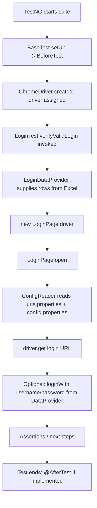

# Automation (Selenium + TestNG)

UI test automation for RestoreSkill using **Selenium WebDriver**, **TestNG**, **PageFactory**, **DataProvider**, and **Excel**-driven test data.

---

## Prerequisites

- **Java 17** (matches `maven.compiler.release` in `pom.xml`)
- **Maven 3.x**
- **Google Chrome** installed (tests use `ChromeDriver`; Selenium Manager resolves the driver in supported setups)

---

## Repository layout (what lives where)

| Path | Role |
|------|------|
| `pom.xml` | Maven project definition: dependencies (Selenium, TestNG, Apache POI, logging, etc.) and build settings. |
| `src/main/java/com/restoreSkill/Automation/base/BaseTest.java` | Test base class: creates `WebDriver` in `@BeforeTest`, exposes `driver` to subclasses. |
| `src/main/java/com/restoreSkill/Automation/locators/LoginPageLocators.java` | **Locators only** for the login module: XPath strings as constants (no WebDriver logic). |
| `src/main/java/com/restoreSkill/Automation/pages/login/LoginPage.java` | **Page object** for login: `PageFactory` + `@FindBy` using locators from `LoginPageLocators`; methods like `open()`, `loginWith()`, `isDashboardVisible()`. |
| `src/main/java/com/restoreSkill/Automation/pages/login/ProviderLoginPageObject.java` | Stub/example page object for a provider flow; placeholders only (empty XPath). Extend when automating that module. |
| `src/main/java/com/restoreSkill/Automation/utils/ConfigReader.java` | Loads `urls.properties` + `config.properties` from the classpath and exposes getters (`getUiLoginUrl()`, `getUiUsername()`, etc.). |
| `src/main/java/com/restoreSkill/Automation/utils/ExcelUtils.java` | Reads rows from an `.xlsx` sheet into `Object[][]` for TestNG `DataProvider`. Can create a default Excel file if missing. |
| `src/main/resources/config/urls.properties` | **UI URLs** (login, base, optional dashboard/provider, legacy `login.url`). |
| `src/main/resources/config/config.properties` | **UI credentials** (`ui.username`, `ui.password`); optional override via env vars documented in the file. |
| `src/test/java/com/restoreSkill/Automation/dataproviders/LoginDataProvider.java` | TestNG `@DataProvider(name = "loginData")` that delegates to `ExcelUtils` for the login sheet. |
| `src/test/java/com/restoreSkill/Automation/tests/LoginTest.java` | Sample TestNG test class: extends `BaseTest`, uses `loginData` provider, drives `LoginPage`. |
| `src/test/java/com/restoreSkill/Automation/tests/LoginAdmin.java` | Empty placeholder test class (skeleton for future cases). |
| `src/test/resources/testdata/LoginData.xlsx` | *(Created at runtime if absent)* Excel used by `LoginDataProvider` — sheet name `LoginData`, header row + data rows. |

Generated output (do not commit as source):

- `target/` — Maven build output  
- `test-output/` — TestNG HTML reports  

---

## Code flow (end-to-end)

The following describes how a typical login test run is orchestrated.



**Step-by-step (plain language):**

1. **Maven / TestNG** discovers test classes under `src/test/java` (for example `LoginTest`).
2. **`BaseTest`** runs **`@BeforeTest`**: builds a **`ChromeDriver`**, maximizes the window, sets implicit wait, and stores the instance in **`driver`**.
3. **`LoginTest`** is annotated with **`@Test(dataProvider = "loginData", dataProviderClass = LoginDataProvider.class)`**.
4. **`LoginDataProvider.getLoginData()`** calls **`ExcelUtils.readSheetData(...)`**, which reads **`src/test/resources/testdata/LoginData.xlsx`** (sheet **`LoginData`**) and returns a **2D array** of cell values (one row per test iteration).
5. The test method receives parameters (for example **`username`**, **`password`**) from that row. Your current `LoginTest` opens the app via **`LoginPage`**; you can wire **`loginPage.loginWith(username, password)`** when ready.
6. **`LoginPage`** uses **PageFactory** (`PageFactory.initElements`) and **`@FindBy(xpath = LoginPageLocators.…)`** so element location strings stay in **`LoginPageLocators`**, not scattered in test code.
7. **`LoginPage.open()`** calls **`ConfigReader.getLoginUrl()`** (or **`getUiLoginUrl()`**), which merges **`urls.properties`** then **`config.properties`** and normalizes the URL (adds `https://` if the protocol is omitted).
8. After the test, lifecycle teardown would run in **`@AfterTest`** in `BaseTest` when uncommented (currently commented in code — re-enable to **`quit()`** the browser).

---

## Configuration flow

```text
urls.properties  ──┐
                   ├──► ConfigReader (merged Properties) ──► getters used by page objects / tests
config.properties ─┘
```

- Change **environment or host** by editing **`src/main/resources/config/urls.properties`**.
- Change **default UI credentials** in **`src/main/resources/config/config.properties`**, or set **`AUTOMATION_UI_USERNAME`** / **`AUTOMATION_UI_PASSWORD`** for CI or local secrets.

---

## Excel data format

- **File:** `src/test/resources/testdata/LoginData.xlsx`  
- **Sheet name:** `LoginData` (see `LoginDataProvider`)  
- **Row 1:** column headers (for example `username`, `password`)  
- **Row 2+:** data rows; each row becomes one invocation of the test method with parameters in column order  

If the file is missing, **`ExcelUtils.ensureExcelExists`** can create a minimal workbook with sample data (see implementation).

---

## How to run

From the project root:

```bash
mvn clean test
```

In **Eclipse / IntelliJ**, run the TestNG suite or right-click `LoginTest` → Run as TestNG Test.

---

## Design patterns used

| Pattern | Where |
|---------|--------|
| **Page Object** | `LoginPage`, `ProviderLoginPageObject` |
| **PageFactory** | `@FindBy` + `PageFactory.initElements` in page classes |
| **Separation of locators** | `LoginPageLocators` (XPath constants per feature/module) |
| **Data-driven testing** | `@DataProvider` + Excel via `ExcelUtils` |
| **Centralized config** | `ConfigReader` + `urls.properties` / `config.properties` |

---

## Optional next steps

- Uncomment **`tearDown()`** in `BaseTest` to close the browser after each `<test>`.
- Point **`LoginPageLocators`** XPaths at your real app if they differ from the sample OrangeHRM-style selectors.
- Replace or extend **`ProviderLoginPageObject`** with real locators under `locators/` for that module.
